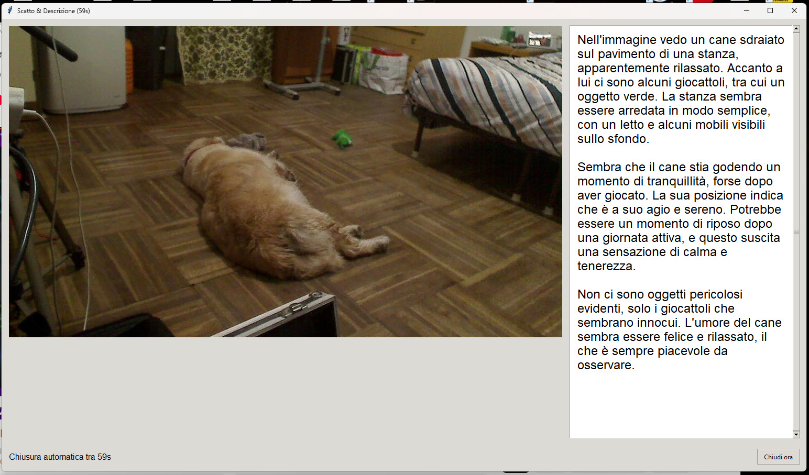

# 🤖 Capture and Describe
[](LICENSE)


## capture_and_describe è un’applicazione cross-platform (Windows e Raspberry Pi/Linux) che permette di:

- Catturare un’immagine dalla webcam integrata o esterna
- Inviare lo scatto a OpenAI Vision per ottenere una descrizione automatica del contenuto
- Generare un file audio TTS con la descrizione (in formato MP3/WAV)
- Riprodurre l’audio in tempo reale sul sistema operativo (con back-end differenziato tra Windows e Linux)
- Salvare automaticamente sia l’immagine catturata che il file audio in una cartella dedicata sul Desktop

In pratica, con un solo click puoi scattare una foto, farla descrivere dall’AI e ascoltare la descrizione vocale generata.

## 🖼️ Screenshot




## È utile per:

- testing di computer vision e TTS su hardware leggero (es. Raspberry Pi),
- progetti di accessibilità (descrizione vocale delle immagini),
- dimostrazioni didattiche di AI multimodale in ambito STEM.

## Installazione

## Windows 10/11
## 1. Installa Python 3.11+ (consigliato) e `pip`.
## 2. Scarica **FFmpeg per Windows** e copia tutti i file in BIN dentro `./ffmpeg_bin/` accanto allo script.

- Scarica: https://www.gyan.dev/ffmpeg/builds/ffmpeg-release-essentials.7z

```
          - ffmpeg_bin/

            - ffmpeg.exe      
            - ffprobe.exe
            - avcodec-62.dll
            - avdevice-62.dll
            - avfilter-11.dll
            - avformat-62.dll
            - avutil-60.dll
            - ffplay.exe
            - swresample-6.dll
            - swscale-9.dll

```

## 3. Crea ed attiva la venv:
   ```powershell
   python -m venv .venv
   .\.venv\Scripts\activate
   
   ```
## 4 Installa dipendenze:

```
pip install -r requirements.txt
```

Su Windows simpleaudio non viene installato: l'audio usa automaticamente winsound (fallback integrato).

## 5 Edita .env.example con la tua chiave e salvalo come .env 
### Modifica i paramentri e il prompt come preferisci
```
OPENAI_API_KEY=sk-...

```

## 6 Avvio
```
python capture_and_describe.py

```


## Raspberry Pi / Linux (Debian/Ubuntu)
```
sudo apt update
sudo apt install -y ffmpeg python3-tk python3-pil.imagetk
python3 -m venv .venv
source .venv/bin/activate
pip install -r requirements.txt
echo "OPENAI_API_KEY=sk-..." > .env
python capture_and_describe.py
```

Note audio

Linux/Raspberry: l’audio usa simpleaudio (installato via pip); assicurati di avere ALSA funzionante.

Windows: se simpleaudio non è disponibile (es. Python 3.11), l’app usa automaticamente winsound convertendo a WAV.

---

## 📜 Licenza

Questo progetto è distribuito sotto licenza **MIT**.  
Vedi il file [LICENSE](LICENSE) per i dettagli.

---


